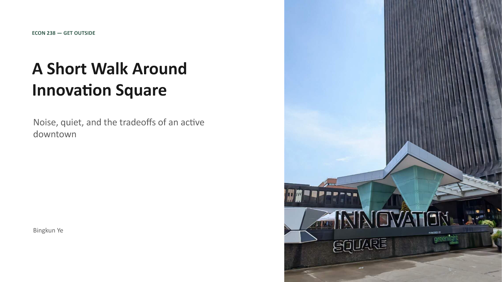
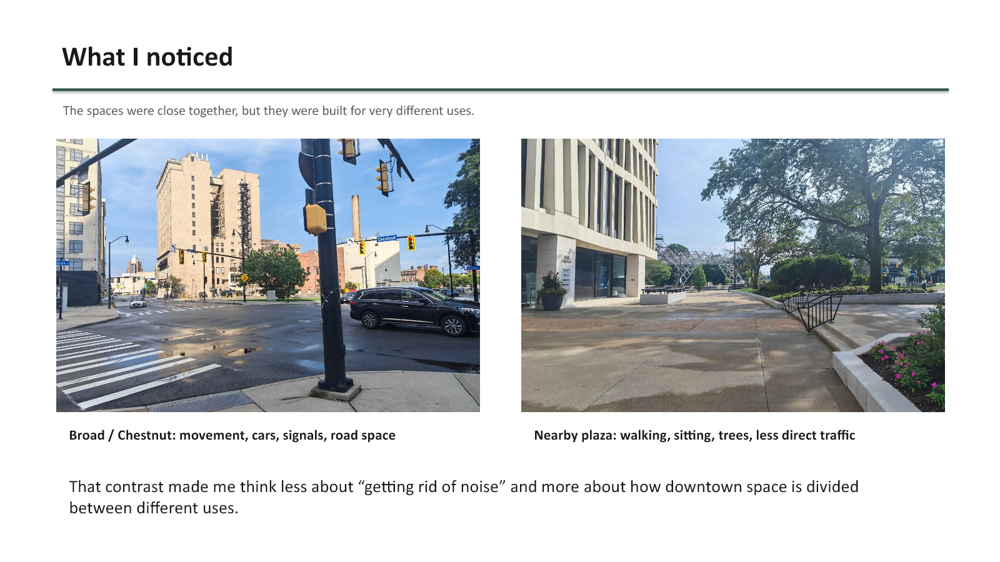
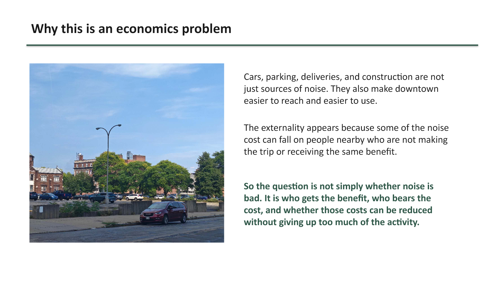
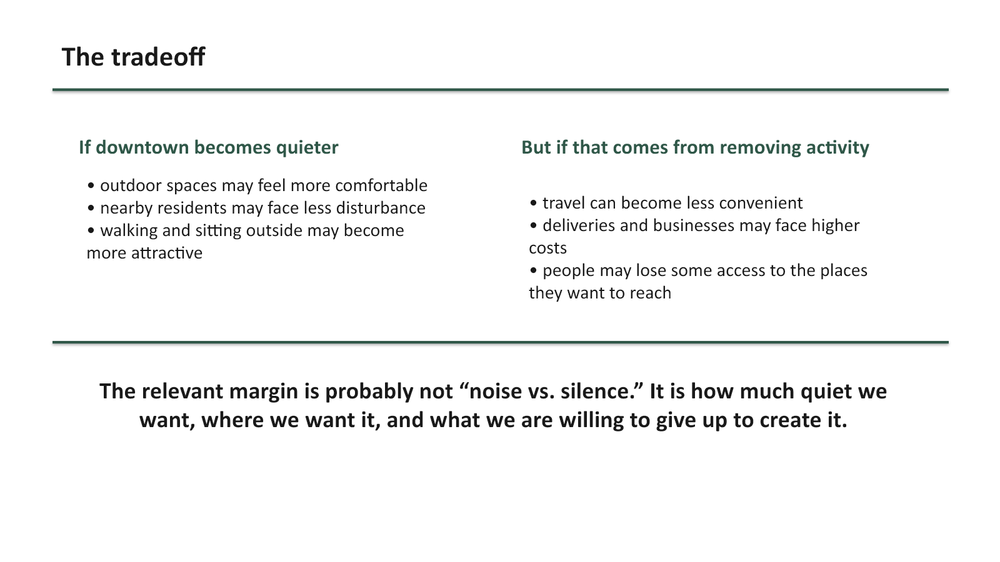
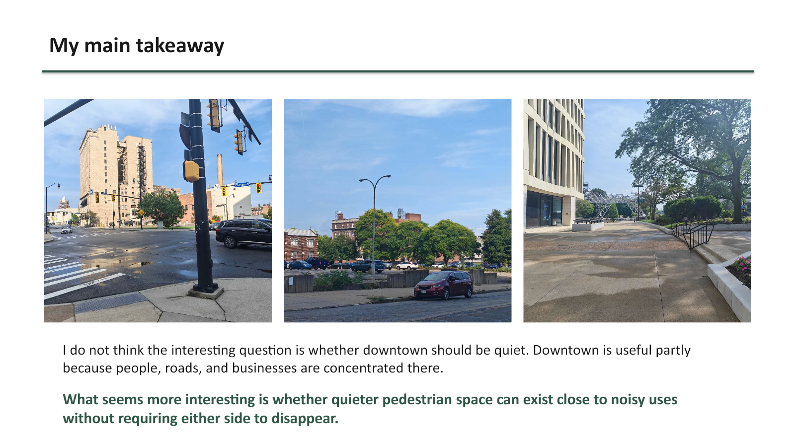
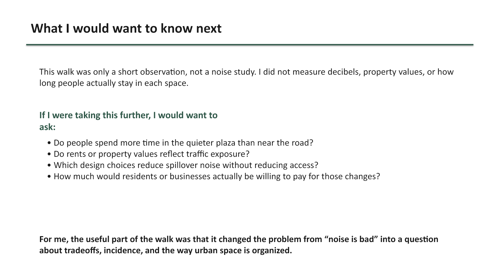

# Assignment 1: Get Outside

## A Short Walk Around Innovation Square

Noise, quiet, and the tradeoffs of an active downtown

[Download the original PowerPoint presentation](downloads/assignment-01-get-outside.pptx)

